# Smoke Test MCP - Detailed Workflow & Architecture

**Version:** 1.0.0  
**Date:** February 4, 2026

---

## Table of Contents

1. [System Architecture](#system-architecture)
2. [Component Interaction Flow](#component-interaction-flow)
3. [Detailed Use Case Flows](#detailed-use-case-flows)
4. [OOP Class Hierarchy](#oop-class-hierarchy)
5. [Configuration Flow](#configuration-flow)
6. [Error Handling Strategy](#error-handling-strategy)
7. [Performance Optimization](#performance-optimization)

---

## System Architecture

### High-Level Architecture Diagram

```
┌─────────────────────────────────────────────────────────────────┐
│                         LLM (Claude/GPT)                        │
│                    (Interactive Conversation)                    │
└───────────────────────────────┬─────────────────────────────────┘
                                │ MCP Protocol (SSE/HTTP)
                                ▼
┌─────────────────────────────────────────────────────────────────┐
│                      MCP Server (FastMCP)                       │
│  ┌─────────────────────────────────────────────────────────┐   │
│  │                    Tools Layer                           │   │
│  │  • start_smoke_test                                      │   │
│  │  • download_storagegrid_file                             │   │
│  │  • compare_csv_files                                     │   │
│  │  • export_database_table                                 │   │
│  │  • mcp_feedback (GitHub integration)                     │   │
│  └──────────────────────┬──────────────────────────────────┘   │
│                         │                                        │
│  ┌──────────────────────▼──────────────────────────────────┐   │
│  │                  Services Layer (OOP)                    │   │
│  │  ┌────────────────┐  ┌─────────────────┐               │   │
│  │  │StorageGrid     │  │ CSVComparer     │               │   │
│  │  │Client          │  │                 │               │   │
│  │  └────────────────┘  └─────────────────┘               │   │
│  │  ┌────────────────┐  ┌─────────────────┐               │   │
│  │  │DatabaseExporter│  │ ReportGenerator │               │   │
│  │  │(Oracle/MySQL)  │  │ (HTML/CSV/Zip)  │               │   │
│  │  └────────────────┘  └─────────────────┘               │   │
│  │  ┌────────────────────────────────────┐                │   │
│  │  │    SessionManager                  │                │   │
│  │  │    (PostgreSQL)                    │                │   │
│  │  └────────────────────────────────────┘                │   │
│  └──────────────────────┬──────────────────────────────────┘   │
└────────────────────────┼────────────────────────────────────────┘
                         │
        ┌────────────────┼────────────────┐
        │                │                │
        ▼                ▼                ▼
┌──────────────┐  ┌──────────────┐  ┌──────────────┐
│ StorageGrid  │  │ PostgreSQL   │  │ Oracle/MySQL │
│   (S3 API)   │  │  (Sessions)  │  │  (Source DB) │
└──────────────┘  └──────────────┘  └──────────────┘
```

---

## Component Interaction Flow

### Flow 1: Statement Smoke Test (End-to-End)

```mermaid
sequenceDiagram
    participant User
    participant LLM
    participant Tool as Tools Layer
    participant SM as SessionManager
    participant SG as StorageGridClient
    participant CSV as CSVComparer
    participant RG as ReportGenerator
    participant DB as PostgreSQL

    User->>LLM: "Start statement smoke test"
    LLM->>Tool: start_smoke_test(test_type="statement", preset="development")
    Tool->>SM: create_session("statement", "development")
    SM->>DB: INSERT INTO test_sessions
    DB-->>SM: session_id: "stmt_20260204_143015"
    SM->>SM: create_test_folder("tests/statement_20260204_143015/")
    SM-->>Tool: TestSession object
    Tool-->>LLM: {session_id, test_folder, next_steps}
    LLM-->>User: "Session created! What's the contract number?"
    
    User->>LLM: "12345"
    LLM->>User: "Payment date?"
    User->>LLM: "2026-02-04"
    LLM->>User: "Transform subtype?"
    User->>LLM: "CREDORAX"
    
    LLM->>Tool: download_storagegrid_file(session_id, file_role="source", contract_number="12345", ...)
    Tool->>SG: StorageGridClient.download_file(...)
    SG->>SG: generate_key() → "statement.12345.2026-02-04.CREDORAX.CSV"
    SG->>SG: s3_client.download_file(bucket, key, local_path)
    SG-->>Tool: DownloadResult(path, size, rows, cols)
    Tool->>SM: add_file_to_session(session_id, file_info)
    SM->>DB: INSERT INTO test_files
    Tool-->>LLM: {download_status: "success", file_path, size, rows, ...}
    LLM-->>User: "✅ Source file downloaded: 12.5 MB, 45,320 rows. Run your ETL process."
    
    User->>LLM: "ETL complete, continue"
    LLM->>User: "Download target from same location or specify new?"
    User->>LLM: "Same location"
    
    LLM->>Tool: download_storagegrid_file(session_id, file_role="target", ...)
    Tool->>SG: StorageGridClient.download_file(...)
    SG-->>Tool: DownloadResult
    Tool->>SM: add_file_to_session(session_id, file_info)
    Tool-->>LLM: {download_status: "success", ...}
    LLM-->>User: "✅ Target file downloaded: 12.6 MB, 45,500 rows. Ready to compare?"
    
    User->>LLM: "Yes, ignore 'timestamp' column"
    
    LLM->>Tool: compare_csv_files(session_id, ignore_columns=["timestamp"])
    Tool->>CSV: CSVComparer.compare(source_path, target_path, options)
    CSV->>CSV: Check file sizes → Use streaming mode (files > 100MB)
    CSV->>CSV: Load chunks, apply filters, sort, compare
    CSV->>CSV: Calculate match_score: 98.5%
    CSV-->>Tool: ComparisonResult(match_score=98.5, mismatched_rows=45, ...)
    
    Tool->>RG: ReportGenerator.generate_report(result, session_info)
    RG->>RG: _generate_html() → Create interactive report
    RG->>RG: _generate_csv() → Create CSV of mismatches
    RG->>RG: _create_zip_package([html, csv])
    RG-->>Tool: ReportOutput(html_path, csv_path, zip_path, summary_text)
    
    Tool->>SM: save_comparison_result(session_id, result, report)
    SM->>DB: INSERT INTO comparison_results
    SM->>DB: INSERT INTO mismatch_details (batch insert)
    Tool->>SM: update_session_status(session_id, "completed")
    
    Tool-->>LLM: {comparison_status, match_score, summary_text, zip_path, ...}
    LLM-->>User: "✅ Comparison complete! Match score: 98.5%\n\nFound 45 mismatches across 3 columns.\n\n📦 [Download Report](file:///path/report.zip)"
```



---

## Detailed Use Case Flows

### Use Case 1: Statement Smoke Test with StorageGrid

**Actors:** User, LLM, MCP Tools, StorageGridClient, SessionManager, CSVComparer, ReportGenerator

**Preconditions:**
- StorageGrid credentials configured in settings.yaml
- PostgreSQL database initialized with mcp_smoke schema
- Test folder structure exists

**Main Flow:**

1. **Session Initialization**
   - User triggers: "Start statement smoke test"
   - Tool: `start_smoke_test(test_type="statement", preset="development")`
   - SessionManager creates unique session ID: `stmt_YYYYMMDD_HHMMSS`
   - SessionManager creates test folder: `tests/statement_YYYYMMDD_HHMMSS/`
   - Database records session in `mcp_smoke.test_sessions` (status: "active")
   - Return: Session info to LLM

2. **Source File Download (Interactive)**
   - LLM prompts user for parameters:
     - Contract number (e.g., "12345")
     - Payment date (e.g., "2026-02-04")
     - Transform subtype (e.g., "CREDORAX")
   - Tool: `download_storagegrid_file(session_id, file_role="source", ...params)`
   - StorageGridClient.generate_key() creates: `statement.12345.2026-02-04.CREDORAX.CSV`
   - StorageGridClient downloads file to: `tests/statement_YYYYMMDD_HHMMSS/source.csv`
   - Tool analyzes CSV: row count, column count, file size
   - Database records file in `mcp_smoke.test_files` (file_role: "source")
   - Return: Download details to LLM
   - LLM informs user: "File downloaded: 12.5 MB, 45,320 rows"

3. **User ETL Process (Manual Step)**
   - LLM instructs: "Run your ETL process. When done, say 'continue'"
   - User executes external ETL
   - ETL overwrites file in StorageGrid (same key)
   - User confirms: "continue"

4. **Target File Download**
   - LLM asks: "Download from same location or new location?"
   - User chooses: "Same location"
   - Tool: `download_storagegrid_file(session_id, file_role="target", ...same_params)`
   - StorageGridClient downloads updated file to: `tests/statement_YYYYMMDD_HHMMSS/target.csv`
   - Database records target file
   - Return: Download details to LLM

5. **Comparison Configuration**
   - LLM asks: "Any columns to ignore?"
   - User specifies: "timestamp, audit_id"
   - LLM asks: "Any other comparison options?"
   - User: "No, proceed"

6. **CSV Comparison**
   - Tool: `compare_csv_files(session_id, ignore_columns=["timestamp", "audit_id"])`
   - CSVComparer loads comparison config from settings.yaml
   - CSVComparer checks file sizes:
     - If > 100 MB: Enable streaming mode
     - If < 100 MB: In-memory comparison
   - Comparison steps:
     1. Load source and target DataFrames (or chunks)
     2. Remove ignored columns
     3. Sort by remaining columns
     4. Compare row-by-row
     5. Identify mismatches, source-only rows, target-only rows
     6. Calculate match score: `(matched_rows / total_rows) * 100`
   - Store mismatch details (limited by max_rows_in_report)
   - Return: ComparisonResult object

7. **Report Generation**
   - ReportGenerator receives ComparisonResult
   - Load report config from settings.yaml (formats: ["html"])
   - Generate reports based on config:
     - **HTML Report:**
       - Section 1 (Summary): Match score, quality rating, key stats, charts
       - Section 2 (Details): Paginated table of mismatches with search
     - **CSV Report** (if enabled):
       - Headers: row_number, column_name, source_value, target_value
       - All mismatches up to max_rows_in_report
   - Package files into zip: `comparison_report_YYYYMMDD_HHMMSS.zip`
   - Generate summary text for LLM
   - Return: ReportOutput object

8. **Session Completion**
   - SessionManager saves comparison results to database:
     - `mcp_smoke.comparison_results` (summary)
     - `mcp_smoke.mismatch_details` (detailed rows)
   - SessionManager updates session status: "completed"
   - Tool returns full result to LLM

9. **User Communication**
   - LLM receives summary_text and zip_path
   - LLM shows ONLY summary to user:
     ```
     ✅ Comparison complete! Match score: 98.5%
     
     Found 45 mismatches across 3 columns:
     - amount: 30 differences
     - status: 10 differences
     - description: 5 differences
     
     📦 Download complete report: [comparison_report_20260204_143015.zip](file:///path/to/report.zip)
     
     The zip contains:
     - Interactive HTML report with search and filtering
     - Detailed CSV of all mismatches
     - Source/target file metadata
     ```

**Alternative Flows:**

- **AF1: File Not Found in StorageGrid**
  - StorageGridClient catches boto3.exceptions.NoSuchKey
  - Return error with expected key format
  - LLM suggests checking parameters

- **AF2: CSV Format Mismatch**
  - CSVComparer detects different column sets
  - Return error listing source columns vs target columns
  - LLM asks user if columns were renamed

- **AF3: Large File (>2GB)**
  - CSVComparer automatically enables streaming mode
  - LLM provides progress updates: "Processed 500,000 rows, found 12 mismatches so far..."
  - Continues processing until complete

---

### Use Case 2: Database Table Comparison

**Actors:** User, LLM, MCP Tools, DatabaseExporter, SessionManager, CSVComparer, ReportGenerator

**Main Flow:**

1. **Session Initialization**
   - User: "Compare database tables"
   - Tool: `start_smoke_test(test_type="database_table", preset="production")`
   - SessionManager creates session

2. **Source Database Export**
   - LLM prompts:
     - Database type: "Oracle or MySQL?"
     - User: "Oracle"
     - Preset: "production"
     - Table name: "TRANSACTIONS"
     - Filter: "WHERE transaction_date = '2026-02-04'"
   - Tool: `export_database_table(session_id, db_type="oracle", preset="production", table_name="TRANSACTIONS", where_clause="...")`
   - DatabaseExporter connects to Oracle using asyncpg
   - Generates query: `SELECT * FROM TRANSACTIONS WHERE transaction_date = '2026-02-04' ORDER BY transaction_id`
   - Exports to CSV in chunks (10,000 rows per chunk)
   - Saves to: `tests/database_table_YYYYMMDD_HHMMSS/source.csv`
   - Return: Export statistics (rows, columns, size, time)

3. **User ETL Process**
   - LLM: "Source exported: 125,000 rows. Run your ETL."
   - User runs ETL
   - User: "continue"

4. **Target Database Export**
   - LLM: "Same database and table?"
   - User: "Yes"
   - Tool: `export_database_table(session_id, db_type="oracle", preset="production", table_name="TRANSACTIONS", where_clause="...", file_role="target")`
   - DatabaseExporter exports updated data
   - Saves to: `tests/database_table_YYYYMMDD_HHMMSS/target.csv`

5. **Comparison & Reporting**
   - Same as Statement flow (steps 5-9)

---

### Use Case 3: File Upload and Direct Comparison

**Actors:** User, LLM, MCP Tools, FileHandler, SessionManager, CSVComparer, ReportGenerator

**Preconditions:**
- File upload enabled in settings.yaml
- Upload directory exists and is writable
- User has CSV or ZIP files to compare

**Main Flow:**

1. **File Upload Initiation**
   - User drags and drops file into chat or clicks upload button
   - User uploads: `before_etl.csv` (250 MB)
   - Chat interface sends file to MCP via multipart/form-data

2. **First File Processing**
   - Tool: `handle_uploaded_files(files=[uploaded_file], file_role="auto")`
   - FileHandler receives uploaded file
   - FileHandler validates:
     - File extension: `.csv` ✓
     - File size: 250 MB < 5120 MB limit ✓
   - FileHandler creates session: `upload_20260204_143015`
   - FileHandler saves to: `uploads/upload_20260204_143015/source.csv`
   - FileHandler analyzes CSV:
     - Row count: 125,000
     - Column count: 45
     - Columns: ['transaction_id', 'amount', 'status', ...]
     - File size: 250 MB
   - SessionManager records file in database (file_role: "source")
   - Return: File details and next action

3. **LLM Communication**
   - LLM receives file details
   - LLM to User:
     ```
     ✅ Received before_etl.csv
     
     File details:
     - Size: 250 MB
     - Rows: 125,000
     - Columns: 45
     
     This will be the SOURCE file. Upload the TARGET file to compare, 
     or provide a file path.
     ```

4. **Second File Upload**
   - User uploads: `after_etl.csv` (255 MB)
   - Tool: `handle_uploaded_files(files=[uploaded_file], session_id="upload_20260204_143015", file_role="target")`
   - FileHandler validates and saves to same session folder
   - Saves to: `uploads/upload_20260204_143015/target.csv`
   - Analyzes CSV: 127,500 rows (2,500 more than source)
   - SessionManager records target file
   - Return: Ready for comparison

5. **Comparison Configuration**
   - LLM to User:
     ```
     ✅ Both files received!
     
     SOURCE: before_etl.csv (125,000 rows)
     TARGET: after_etl.csv (127,500 rows)
     
     Note: Target has 2,500 more rows.
     
     Do you want to:
     • Ignore any columns?
     • Apply any filters?
     • Start comparison now?
     ```
   - User: "Ignore 'timestamp' and 'audit_user' columns, compare now"

6. **Comparison Execution**
   - Tool: `compare_csv_files(session_id="upload_20260204_143015", ignore_columns=["timestamp", "audit_user"])`
   - CSVComparer loads both files (250 MB < streaming threshold, use in-memory)
   - Removes ignored columns
   - Sorts by remaining columns
   - Compares row-by-row
   - Finds:
     - 122,500 matched rows
     - 0 mismatched rows
     - 2,500 source-only rows
     - 5,000 target-only rows
   - Match score: 96.0% (122,500 / 127,500)
   - Return: ComparisonResult

7. **Report Generation**
   - ReportGenerator creates HTML report
   - Sections:
     - Summary: 96% match, "Good" rating (yellow)
     - Details: 2,500 rows only in source, 5,000 rows only in target
   - Packages as ZIP
   - Return: ReportOutput

8. **Results Communication**
   - LLM to User:
     ```
     ✅ Comparison complete! Match score: 96.0%
     
     Analysis:
     - 122,500 rows matched perfectly
     - 2,500 rows only in SOURCE (possibly deleted by ETL)
     - 5,000 rows only in TARGET (possibly new data)
     - 0 rows with differences
     
     📦 Download detailed report: [comparison_upload_20260204_143015.zip](file:///path/to/report.zip)
     
     Recommendation: Review the 2,500 deleted rows to ensure they 
     were intentionally removed by your ETL process.
     ```

**Alternative Flows:**

- **AF1: ZIP File Uploaded**
  - User uploads: `data_export.zip`
  - FileHandler extracts ZIP
  - Finds: `statement.csv`, `invoice.csv`, `gl.csv`
  - LLM: "I extracted 3 CSV files: statement.csv (120 MB), invoice.csv (80 MB), gl.csv (50 MB). Which one do you want to use as source?"
  - User: "statement.csv"
  - FileHandler marks `statement.csv` as source
  - Continues with target file request

- **AF2: Both Files Uploaded Simultaneously**
  - User selects both files and uploads at once
  - FileHandler receives: [`file1.csv`, `file2.csv`]
  - FileHandler assigns roles based on filename or upload order:
    - `file1.csv` → source
    - `file2.csv` → target
  - LLM: "I have both files. Compare them now?"
  - User: "Yes"
  - Proceeds directly to comparison

- **AF3: Invalid File Type**
  - User uploads: `document.pdf`
  - FileHandler validates: `.pdf` not in allowed_extensions
  - Return error
  - LLM: "❌ Sorry, only CSV and ZIP files are supported. Please upload a CSV file or a ZIP containing CSV files."

- **AF4: File Too Large**
  - User uploads: `huge_data.csv` (6 GB)
  - FileHandler checks size: 6144 MB > 5120 MB limit
  - Return error
  - LLM: "❌ File size (6 GB) exceeds the maximum limit of 5 GB. Try using streaming mode with a file path instead of uploading."

- **AF5: ZIP with No CSV Files**
  - User uploads: `images.zip` (contains only .jpg files)
  - FileHandler extracts and scans: No .csv files found
  - Return error
  - LLM: "❌ The ZIP file doesn't contain any CSV files. Please upload a ZIP containing at least one CSV file."

---

## OOP Class Hierarchy

### Class Diagram

```
┌─────────────────────────────────────────────────────────────────┐
│                       Base Classes                              │
└─────────────────────────────────────────────────────────────────┘

┌────────────────────┐
│   BaseClient       │  (Abstract)
├────────────────────┤
│ + config: Dict     │
│ + logger: Logger   │
├────────────────────┤
│ + connect()        │
│ + close()          │
│ + health_check()   │
└────────────────────┘
         △
         │
    ┌────┴────┬──────────────┐
    │         │              │
┌───────────────┐  ┌──────────────────┐  ┌──────────────────┐
│StorageGrid    │  │DatabaseExporter  │  │HTTPClient        │
│Client         │  │                  │  │(GitHub API)      │
├───────────────┤  ├──────────────────┤  ├──────────────────┤
│+bucket:str    │  │+db_type:str      │  │+base_url:str     │
│+doc_type:str  │  │+pool:asyncpg     │  │+token:str        │
├───────────────┤  ├──────────────────┤  ├──────────────────┤
│+generate_key()│  │+export_table()   │  │+create_issue()   │
│+download()    │  │+execute_query()  │  │+update_issue()   │
│+list_files()  │  │+get_columns()    │  └──────────────────┘
└───────────────┘  └──────────────────┘

┌─────────────────────────────────────────────────────────────────┐
│                    Service Classes                              │
└─────────────────────────────────────────────────────────────────┘

┌──────────────────┐       ┌──────────────────┐       ┌──────────────────┐
│CSVComparer       │       │ReportGenerator   │       │SessionManager    │
├──────────────────┤       ├──────────────────┤       ├──────────────────┤
│+config:Config    │       │+config:Config    │       │+db_pool          │
├──────────────────┤       │+jinja_env        │       ├──────────────────┤
│+compare()        │       ├──────────────────┤       │+create_session() │
│+_in_memory()     │       │+generate_report()│       │+get_session()    │
│+_streaming()     │       │+_generate_html() │       │+add_file()       │
│+_apply_filters() │       │+_generate_csv()  │       │+save_result()    │
│+calc_score()     │       │+_create_zip()    │       │+update_status()  │
└──────────────────┘       │+_quality_rating()│       └──────────────────┘
                           └──────────────────┘

┌──────────────────┐
│FileHandler       │
├──────────────────┤
│+config:Config    │
├──────────────────┤
│+handle_upload()  │
│+validate_file()  │
│+extract_zip()    │
│+analyze_csv()    │
│+cleanup_old()    │
└──────────────────┘

┌─────────────────────────────────────────────────────────────────┐
│                     Data Classes                                │
└─────────────────────────────────────────────────────────────────┘

@dataclass                 @dataclass                @dataclass
ComparisonConfig           ComparisonOptions         ComparisonResult
├─chunk_size:int           ├─ignore_columns:List     ├─match_score:float
├─streaming_threshold:int  ├─ignore_source:List      ├─total_rows_src:int
├─case_sensitive:bool      ├─ignore_target:List      ├─total_rows_tgt:int
└─trim_whitespace:bool     ├─sort_by:List            ├─matched_rows:int
                           └─max_mismatches:int      ├─mismatched_rows:int
                                                     ├─mismatch_details:List
                                                     ├─comparison_time:float
                                                     └─memory_used_mb:float

@dataclass                 @dataclass                @dataclass
ReportConfig               ReportOutput              TestSession
├─formats:List             ├─html_path:str           ├─session_id:str
├─max_rows:int             ├─csv_path:str            ├─test_type:str
├─rows_per_page:int        ├─zip_path:str            ├─preset:str
├─include_charts:bool      └─summary_text:str        ├─test_folder:str
├─generate_zip:bool                                  ├─status:str
└─thresholds:Dict                                    ├─created_at:datetime
                                                     ├─source_file:FileInfo
                                                     └─target_file:FileInfo
```

### Class Responsibilities (SOLID Principles)

**Single Responsibility:**
- `StorageGridClient`: Only S3 operations
- `CSVComparer`: Only CSV comparison logic
- `ReportGenerator`: Only report generation
- `SessionManager`: Only database session operations

**Open/Closed:**
- New database types can be added by extending `DatabaseExporter`
- New report formats can be added by extending `ReportGenerator`

**Liskov Substitution:**
- All clients extend `BaseClient`, can be swapped
- Mock clients can replace real clients in tests

**Interface Segregation:**
- Each service has focused interface
- Tools depend only on methods they need

**Dependency Inversion:**
- Tools depend on abstractions (service interfaces), not implementations
- Services receive configuration via dependency injection

---

## Configuration Flow

### Configuration Hierarchy

```
1. Environment Variables (.env)
   ├─ Database credentials
   ├─ StorageGrid keys
   ├─ GitHub token
   └─ Basic settings
         │
         ▼
2. settings.yaml (Defaults with ${VAR} references)
   ├─ Presets for all systems
   ├─ Report configuration
   ├─ Thresholds
   └─ Feature flags
         │
         ▼
3. Tool Parameters (Runtime overrides)
   ├─ User-specified options
   ├─ Session-specific settings
   └─ One-time overrides
         │
         ▼
4. Service Initialization (Final merged config)
```

### Configuration Loading Sequence

```python
# 1. Load environment variables
load_dotenv()

# 2. Load settings.yaml with variable substitution
config = ConfigLoader.load('config/settings.yaml')

# 3. Tool receives parameters
@mcp.tool(name="compare_csv_files", description="...")
def compare_csv_files(
    session_id: str,
    ignore_columns: List[str] = None,
    generate_html: bool = None  # Override settings.yaml
):
    # 4. Merge configurations (priority: params > yaml > env)
    final_config = merge_configs(
        base=config['smoke_test']['csv_comparison'],
        overrides={'generate_html': generate_html} if generate_html else {}
    )
    
    # 5. Initialize service with final config
    comparer = CSVComparer(final_config)
```

---

## Error Handling Strategy

### Error Hierarchy

```
SmokeTestError (Base Exception)
├─ SessionError
│  ├─ SessionNotFoundError
│  ├─ SessionExpiredError
│  └─ SessionConflictError
│
├─ StorageError
│  ├─ FileNotFoundError (S3 404)
│  ├─ ConnectionTimeoutError
│  └─ AuthenticationError
│
├─ ComparisonError
│  ├─ CSVFormatError
│  ├─ ColumnMismatchError
│  └─ OutOfMemoryError
│
└─ DatabaseError
   ├─ ConnectionError
   ├─ QueryTimeoutError
   └─ ExportError
```

### Error Handling Pattern

```python
class StorageGridClient:
    def download_file(self, **kwargs) -> DownloadResult:
        try:
            key = self.generate_key(**kwargs)
            self.logger.info(f"Downloading {key}")
            
            # Download operation
            self.s3_client.download_file(self.bucket, key, local_path)
            
            # Return success
            return DownloadResult(status="success", path=local_path, ...)
            
        except botocore.exceptions.NoSuchKey:
            # User-friendly error message
            return DownloadResult(
                status="error",
                error_type="FileNotFound",
                error_message=(
                    f"File not found in StorageGrid.\n"
                    f"Expected key: {key}\n"
                    f"Bucket: {self.bucket}\n\n"
                    f"Suggestions:\n"
                    f"• Check contract number is correct\n"
                    f"• Verify payment date format (YYYY-MM-DD)\n"
                    f"• Ensure file was uploaded to StorageGrid"
                )
            )
        
        except botocore.exceptions.EndpointConnectionError as e:
            self.logger.error(f"Connection failed: {e}")
            return DownloadResult(
                status="error",
                error_type="ConnectionTimeout",
                error_message=(
                    f"Cannot connect to StorageGrid.\n"
                    f"Endpoint: {self.endpoint_url}\n\n"
                    f"Check:\n"
                    f"• Network connectivity\n"
                    f"• Endpoint URL in configuration\n"
                    f"• Firewall rules"
                )
            )
        
        except Exception as e:
            self.logger.exception(f"Unexpected error: {e}")
            return DownloadResult(
                status="error",
                error_type="UnexpectedError",
                error_message=f"Unexpected error occurred: {str(e)}"
            )
```

### Error Communication to LLM

Tools return structured error information that LLMs can interpret:

```python
{
    "status": "error",
    "error_type": "FileNotFound",
    "error_message": "User-friendly explanation",
    "suggestions": ["Action 1", "Action 2"],
    "context": {
        "session_id": "stmt_...",
        "attempted_key": "statement.12345..."
    }
}
```

LLM translates this to conversational language:
```
❌ Couldn't find the file in StorageGrid.

I was looking for: statement.12345.2026-02-04.CREDORAX.CSV

Let's check:
• Is the contract number correct? (you said "12345")
• Is the date right? (you said "2026-02-04")
• Was the file uploaded to StorageGrid?
```

---

## Performance Optimization

### Strategy 1: Connection Pooling

**PostgreSQL:**
```python
# Single pool created at startup, reused across all requests
pool = await asyncpg.create_pool(
    min_size=10,
    max_size=20,
    command_timeout=60
)

# Services receive pool reference
session_manager = SessionManager(db_pool=pool)
```

**Benefits:**
- Avoid connection overhead (10-50ms per connection)
- Support concurrent operations
- Automatic connection health checks

---

### Strategy 2: Streaming for Large Files

**CSVComparer Streaming Mode:**

```python
def compare(self, source_path, target_path, options):
    # Check file sizes
    source_size_mb = os.path.getsize(source_path) / (1024 * 1024)
    target_size_mb = os.path.getsize(target_path) / (1024 * 1024)
    
    # Auto-select mode
    if source_size_mb > self.streaming_threshold or target_size_mb > self.streaming_threshold:
        return self._compare_streaming(source_path, target_path, options)
    else:
        return self._compare_in_memory(source_path, target_path, options)

def _compare_streaming(self, source_path, target_path, options):
    """Process files in chunks to minimize memory usage"""
    
    # Use pandas chunking
    for source_chunk, target_chunk in zip(
        pd.read_csv(source_path, chunksize=self.chunk_size),
        pd.read_csv(target_path, chunksize=self.chunk_size)
    ):
        # Process chunk
        mismatches = self._compare_chunks(source_chunk, target_chunk)
        
        # Yield results periodically (for live updates)
        if len(mismatches) > 0:
            yield PartialResult(mismatches_so_far=len(mismatches))
```

**Memory Profile:**
- Small file (10 MB): ~50 MB memory usage
- Large file (1 GB): ~200 MB memory usage (20x more efficient)

---

### Strategy 3: Async Database Operations

```python
async def save_comparison_result(self, session_id, result, report):
    """Save result and mismatches in parallel"""
    
    async with self.db_pool.acquire() as conn:
        async with conn.transaction():
            # Parallel operations
            await asyncio.gather(
                # Save summary
                conn.execute(
                    "INSERT INTO comparison_results (...) VALUES (...)",
                    session_id, result.match_score, ...
                ),
                # Batch insert mismatches
                conn.executemany(
                    "INSERT INTO mismatch_details (...) VALUES ($1, $2, $3, $4)",
                    [(comp_id, m.row, m.col, m.value) for m in result.mismatches[:5000]]
                )
            )
```

---

### Strategy 4: Report Generation Optimization

**HTML Report (Jinja2 Template):**

```python
def _generate_html(self, result: ComparisonResult) -> str:
    # Limit data in HTML (full data in CSV)
    limited_mismatches = result.mismatch_details[:self.config.max_rows_in_report]
    
    # Pre-calculate summary statistics
    summary = {
        'match_score': result.match_score,
        'quality_rating': self._calculate_quality_rating(result.match_score),
        'total_rows': result.total_rows_source,
        'mismatch_by_column': self._group_mismatches_by_column(limited_mismatches)
    }
    
    # Render template with limited data
    template = self.jinja_env.get_template('report_template.html')
    html = template.render(summary=summary, mismatches=limited_mismatches)
    
    return html
```

**Benefits:**
- HTML file size < 5 MB (even for 5000 mismatches)
- Client-side search (no server needed)
- Fast rendering in browser

---

## Next Steps for Implementation

### Phase 1: Core Infrastructure (Week 1)
1. ✅ Requirements document complete
2. ⏳ Install `uv` package manager
3. ⏳ Implement OOP service classes:
   - `StorageGridClient`
   - `SessionManager` with PostgreSQL
   - `CSVComparer` (basic in-memory mode)
   - `FileHandler` (file upload processing)
4. ⏳ Create database schema (015_mcp_smoke_schema.sql)
5. ⏳ Implement core tools:
   - `start_smoke_test`
   - `download_storagegrid_file`
   - `handle_uploaded_files`

### Phase 2: Comparison Engine (Week 2)
6. ⏳ Implement CSVComparer streaming mode
7. ⏳ Add live progress updates
8. ⏳ Implement `compare_csv_files` tool
9. ⏳ Unit tests for comparison logic
10. ⏳ Test file upload with CSV and ZIP files

### Phase 3: Reporting (Week 3)
11. ⏳ Implement ReportGenerator
12. ⏳ Create HTML template (Jinja2)
13. ⏳ Add CSV report generation
14. ⏳ Add zip packaging
15. ⏳ Test multi-format report generation

### Phase 4: Database Integration (Week 4)
16. ⏳ Implement DatabaseExporter (Oracle)
17. ⏳ Implement DatabaseExporter (MySQL)
18. ⏳ Add `export_database_table` tool

### Phase 5: Polish & Testing (Week 5)
19. ⏳ Integration tests (end-to-end flows)
20. ⏳ Test file upload scenarios (CSV, ZIP, both)
21. ⏳ Performance testing (2GB file)
22. ⏳ Error handling refinement
23. ⏳ Documentation (knowledge base)
24. ⏳ Docker Compose setup with uv
25. ⏳ Deployment testing

---

**END OF WORKFLOW DOCUMENT**
